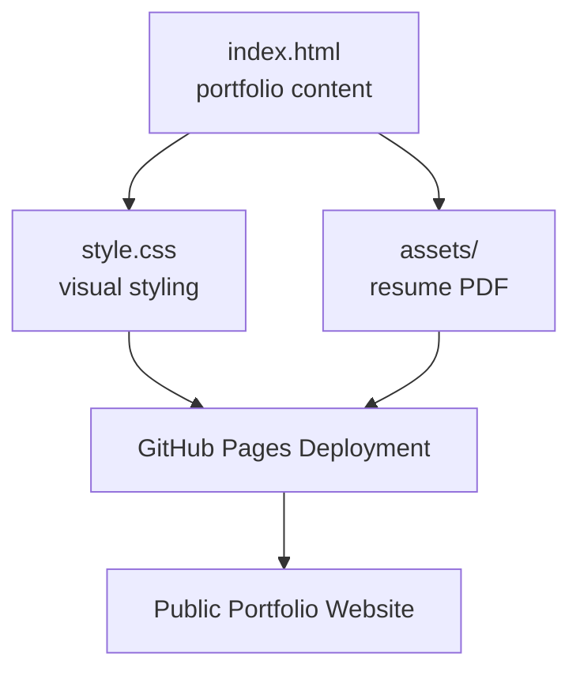

# Praveen Raj A - GitHub Pages Portfolio

**Live Site:** [Open Portfolio](https://praveenraj9623-sketch.github.io/)

**GitHub Repository:** [praveenraj9623-sketch/praveenraj9623-sketch.github.io](https://github.com/praveenraj9623-sketch/praveenraj9623-sketch.github.io)

> A static GitHub Pages portfolio for showcasing data science, machine learning, AI, analytics, and deployed project work.

**[Open Live Site ->](https://praveenraj9623-sketch.github.io/)**

[](https://developer.mozilla.org/docs/Web/HTML)
[](https://developer.mozilla.org/docs/Web/CSS)
[](https://pages.github.com)

[](https://praveenraj9623-sketch.github.io/)
[](https://github.com/praveenraj9623-sketch/praveenraj9623-sketch.github.io)

---

## What is This Project?

This repository powers the public portfolio site at `praveenraj9623-sketch.github.io`. It is a lightweight static website that presents projects, live Streamlit apps, GitHub repositories, resume assets, and professional links.

**Core outcome:** HTML/CSS portfolio -> GitHub Pages deployment -> project discovery hub.

---

## Site Architecture



---

## Tech Stack

| Category | Tools |
|---|---|
| Markup | HTML5 |
| Styling | CSS3 |
| Hosting | GitHub Pages |
| Assets | PDF resume |
| External Links | GitHub, LinkedIn, Streamlit apps |

---

## Repository Structure

```text
praveenraj9623-sketch.github.io/
|-- index.html
|-- style.css
`-- assets/
    `-- Praveen_Raj_A_Lightcast_Data_Scientist_Resume.pdf
```

---

## Featured Portfolio Links

| Project | Link |
|---|---|
| LaborIQ | https://laboriq-labor-market-intelligence-x4rsxl3qrjhi6rhpp9ls5m.streamlit.app/ |
| Enterprise Document Intelligence | https://github.com/praveenraj9623-sketch/enterprise-document-intelligence-platform |
| Retail Demand Intelligence | https://github.com/praveenraj9623-sketch/retail-demand-anomaly-intelligence |
| Business Bankruptcy Risk Scoring | https://github.com/praveenraj9623-sketch/business-bankruptcy-risk-scoring |
| Credit Risk Analytics | https://github.com/praveenraj9623-sketch/credit-risk-analytics-ml-dashboard |
| Computer Vision Quality Inspection | https://github.com/praveenraj9623-sketch/computer-vision-quality-inspection |

---

## Run Locally

No build step is required:

```bash
git clone https://github.com/praveenraj9623-sketch/praveenraj9623-sketch.github.io.git
cd praveenraj9623-sketch.github.io
python -m http.server 8000
```

Then open:

```text
http://localhost:8000
```

---

## Deployment

For a repository named `username.github.io`, GitHub Pages serves the site directly from the default branch.

After pushing updates, the site is available at:

```text
https://praveenraj9623-sketch.github.io/
```

---

## Future Improvements

- Add project screenshots and demo GIFs.
- Add case-study pages for flagship projects.
- Add resume versioning.
- Add structured metadata for SEO.

---

## Author

Built by **Praveen Raj A**

- Portfolio: https://praveenraj9623-sketch.github.io/
- LinkedIn: https://www.linkedin.com/in/praveen-raj-a-b05abb2a3/
- GitHub: https://github.com/praveenraj9623-sketch
- Repository: https://github.com/praveenraj9623-sketch/praveenraj9623-sketch.github.io
